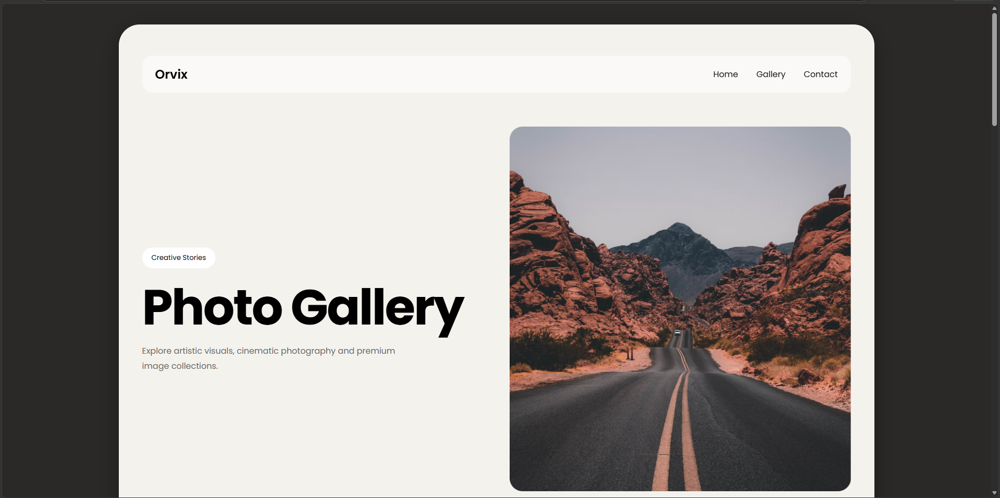
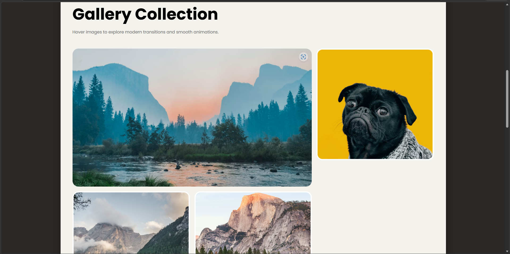

# Image Gallery Website

## Project Description
This project is a responsive Image Gallery Website developed using HTML, CSS, and JavaScript. Users can view images in a clean gallery layout with an attractive and user-friendly interface.

## Features
- Responsive Design
- Image Grid Layout
- Interactive User Interface
- Mobile-Friendly Design
- Fast Loading Gallery

## Technologies Used
- HTML5
- CSS3
- JavaScript

## Project Structure
```
Image-Gallery/
│
├── index.html
├── style.css
├── script.js
└── images/
```

## Screenshots

### Home Page


### Gallery View


## How to Run
1. Download or Clone the Repository
2. Open `index.html` in your browser
3. Explore the Image Gallery

## Learning Outcomes
- Responsive Web Design
- CSS Grid & Flexbox
- JavaScript DOM Manipulation
- Frontend Development Basics
